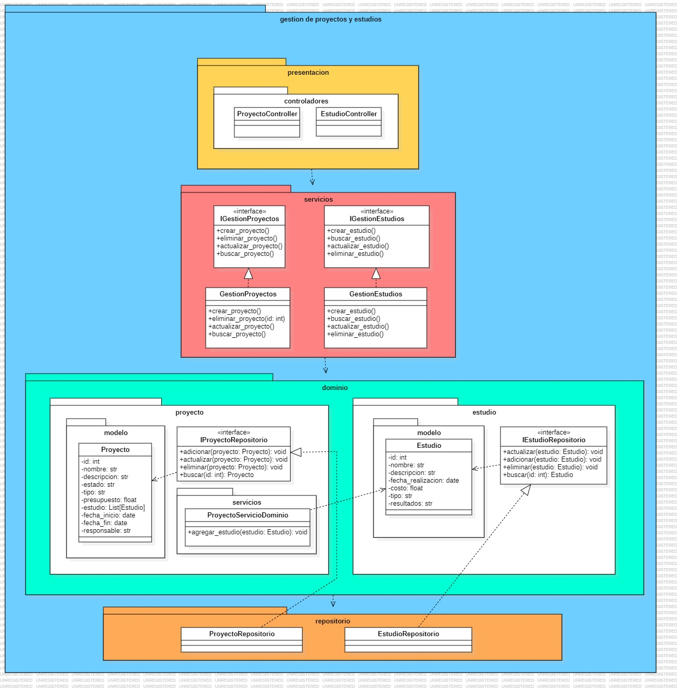

# Implementacion del Microservicio de Gestion de Proyectos y el Microservicio de Gestion de Estudios, guiados por la especificacion de Comportamiento(BDD)

## 1. Descripción
Como el nombre lo indica, estos microservicios se encargan de gestionar los proyectos y estudios, realizando las acciones de creación, actualización, obtención y eliminacion de proyectos y estudios, según sea el caso.

## 2. Arquitectura DDD

### 2.1. Capas de la Arquitectura
#### 2.1.1. Capa de Presentación
    - Controladores
        - ProyectoController: Gestiona las solicitudes HTTP que involucren a un proyecto. Dentro de los métodos a encontrar, están: GET, POST, PUT, DELETE.
        - EstudioController: Gestiona las solicitudes HTTP que involucren a un estudio. Dentro de los métodos a encontrar, están: GET, POST, PUT, DELETE.

#### 2.1.2. Capa de Servicios
    No contienen lógica de negocio compleja, sino que coordinan tareas y llaman a los servicios de dominio, entidades y repositorios.
    - Gestion de Proyectos.
    - Gestión de Estudios.

#### 2.1.3. Capa de Dominio
    - Entidades:
        - Proyecto: Representa la entidad principal para la gestión de proyectos. Contiene atributos como id, nombre, descripcion, estado, entre otros.
        - Estudio: Representa la entidad principal para la gestión de estudios.
        Contiene atributos como id, nombre, descripcion, fecha_realizacion, entre otros.
    - Fábrica:
        Las fábricas encapsulan el proceso de instanciación y aseguran que los objetos se creen en un estado consistente y válido.
    - Servicios de dominio:
        Estos servicios encapsulan lógica de negocio específica del dominio que no se puede asociar directamente con una entidad o un objeto de valor.
        Son parte del núcleo del dominio y se encargan de operaciones que involucran varias entidades o agregados.
    - Interfaces de repositorio:
        - IProyectoRepositorio: Define los métodos que deben ser implementados para la gestión de proyectos.
        - IEstudioRepositorio: Define los métodos que deben ser implementados para la gestión de estudios.

### 2.2 Diagrama

