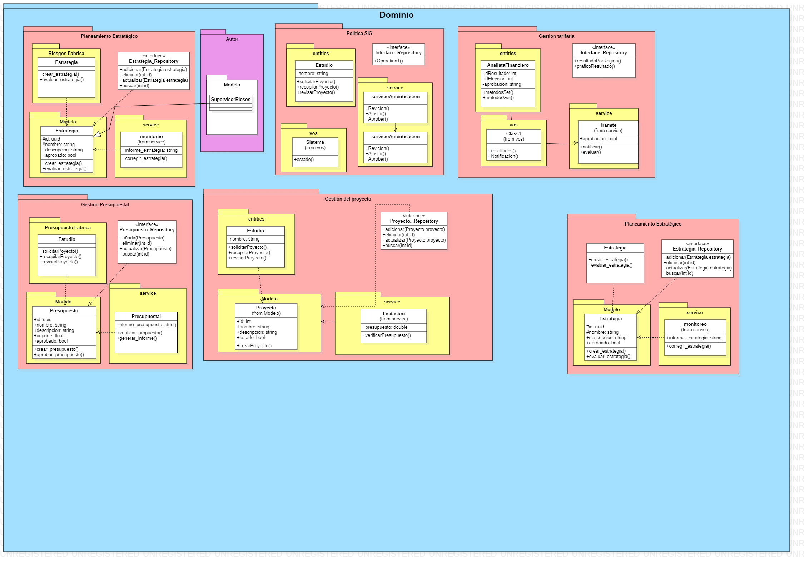

## Postman:

### Gestion Presupuestal
```json
{
	"info": {
		"_postman_id": "19771cc6-2552-4d63-8ccf-5465cbc6a32f",
		"name": "Gestion_Presupuestal",
		"schema": "https://schema.getpostman.com/json/collection/v2.1.0/collection.json",
		"_exporter_id": "37302820",
		"_collection_link": "https://www.postman.com/tecla-industries/workspace/proyecto-sedapal-is3/collection/37308430-19771cc6-2552-4d63-8ccf-5465cbc6a32f?action=share&source=collection_link&creator=37302820"
	},
	"item": [
		{
			"name": "solicitar_presupuesto",
			"event": [
				{
					"listen": "test",
					"script": {
						"exec": [
							"pm.test(\"Status code is 201\", function () {\r",
							"    pm.response.to.have.status(201);\r",
							"});\r",
							"\r",
							"pm.test(\"Response has 'Presupuesto solicitado'\", function () {\r",
							"    var jsonData = pm.response.json();\r",
							"    pm.expect(jsonData.message).to.eql(\"Presupuesto solicitado\");\r",
							"});\r",
							"\r",
							"pm.test(\"Response contains ID\", function () {\r",
							"    var jsonData = pm.response.json();\r",
							"    pm.expect(jsonData).to.have.property(\"id\");\r",
							"});\r",
							""
						],
						"type": "text/javascript",
						"packages": {}
					}
				}
			],
			"request": {
				"method": "POST",
				"header": [],
				"body": {
					"mode": "raw",
					"raw": "{\r\n    \"nombre\": \"Presupuesto de Marketing\",\r\n    \"descripcion\": \"Presupuesto anual para el departamento de marketing\",\r\n    \"importe\": 50000.0\r\n}\r\n",
					"options": {
						"raw": {
							"language": "json"
						}
					}
				},
				"url": {
					"raw": "http://127.0.0.1:5000/presupuesto/solicitar",
					"protocol": "http",
					"host": [
						"127",
						"0",
						"0",
						"1"
					],
					"port": "5000",
					"path": [
						"presupuesto",
						"solicitar"
					]
				}
			},
			"response": []
		},
		{
			"name": "validar_presupuesto",
			"event": [
				{
					"listen": "test",
					"script": {
						"exec": [
							"pm.test(\"Status code is 200\", function () {\r",
							"    pm.response.to.have.status(200);\r",
							"});\r",
							"\r",
							"pm.test(\"Response has 'Presupuesto válido'\", function () {\r",
							"    var jsonData = pm.response.json();\r",
							"    pm.expect(jsonData.message).to.eql(\"Presupuesto válido\");\r",
							"});\r",
							"\r",
							"pm.test(\"Response contains complete property\", function () {\r",
							"    var jsonData = pm.response.json();\r",
							"    pm.expect(jsonData).to.have.property(\"completo\");\r",
							"});\r",
							""
						],
						"type": "text/javascript",
						"packages": {}
					}
				}
			],
			"request": {
				"method": "GET",
				"header": [],
				"url": {
					"raw": "http://127.0.0.1:5000/presupuesto/validar/1",
					"protocol": "http",
					"host": [
						"127",
						"0",
						"0",
						"1"
					],
					"port": "5000",
					"path": [
						"presupuesto",
						"validar",
						"1"
					]
				}
			},
			"response": []
		}
	]
}

```

### Planeamiento Estrategico

```json
{
    "info": {
        "_postman_id": "aef31937-b308-4266-b3c8-2e994db1bc4b",
        "name": "Planeamiento_Estrategico",
        "schema": "https://schema.getpostman.com/json/collection/v2.1.0/collection.json",
        "_exporter_id": "37308775",
        "_collection_link": "https://www.postman.com/tecla-industries/workspace/proyecto-sedapal-is3/collection/37308775-aef31937-b308-4266-b3c8-2e994db1bc4b?action=share&source=collection_link&creator=37308775"
    },
    "item": [
        {
            "name": "Crear Estrategia",
            "request": {
                "method": "GET",
                "header": []
            },
            "response": []
        },
        {
            "name": "Corregir Estrategia",
            "request": {
                "method": "GET",
                "header": []
            },
            "response": []
        }
    ]
}
```


